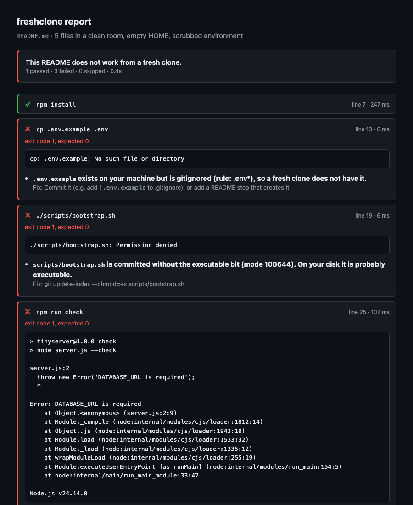
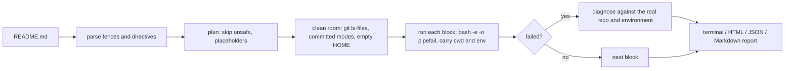

<div align="center">

# freshclone

**Run your README's commands the way a new contributor would, and find out which hidden assumption broke.**

[](https://github.com/Nithinfgs/freshclone/actions/workflows/ci.yml)
[](LICENSE)
[](package.json)
[](package.json)



</div>

## The 20-second version

Your quickstart works on your machine because your machine is full of things a new
contributor does not have: an untracked `.env`, a build directory, an exported
`DATABASE_URL`, `~/.npmrc`, a script that is executable on disk but committed as `644`.

`freshclone` reads the shell blocks in your README, copies **only what a fresh clone
would contain** into a temp directory, runs them with an **empty `HOME` and a scrubbed
environment**, and when something fails it tells you *which assumption* was hiding:

```text
✗ 2  cp .env.example .env
     → `.env.example` exists on your machine but is gitignored (rule: .env*), so a fresh
       clone does not have it.
       fix: Commit it (e.g. add `!.env.example` to .gitignore), or add a README step …
```

## Quick start

Requires Node 20+ and `bash`. macOS and Linux are supported. The package is not on npm
yet, so run it straight from GitHub:

```bash
# 1. Watch it find three bugs in a generated sample project (nothing touches your files)
npx github:Nithinfgs/freshclone --demo

# 2. In your own repo: see what would run, without running it
npx github:Nithinfgs/freshclone --dry-run

# 3. Run it
npx github:Nithinfgs/freshclone
```

By default it checks `README.md`; pass another file (`freshclone docs/setup.md`) to check that instead.
When stdin is a terminal it asks for confirmation first. See [Safety](#safety).

## What the clean room changes

| On your machine | In the clean room |
|---|---|
| Gitignored files (`.env`, `dist/`, `node_modules/`) exist | Not copied |
| Files have whatever mode is on disk | Files get the mode **git recorded** (`100644` vs `100755`) |
| `$HOME` has your dotfiles, `~/.npmrc`, `~/.gitconfig`, caches | Empty `$HOME` |
| Your shell exports `DATABASE_URL`, `AWS_*`, tokens … | Only `PATH`, `LANG`, `TERM`, a temp `TMPDIR`, and toolchain locations (`RUSTUP_HOME`, `NVM_DIR`, …) |
| You are already `cd`'d into the right place | Each block starts where the previous one ended |

Untracked files that are not ignored *are* copied (they would be committed with your
change); use `--tracked-only` to be strict.

## Diagnoses

When a step fails, freshclone checks the evidence before it names a cause:

| Failure | What it tells you |
|---|---|
| `No such file or directory` for a file that exists locally | It is gitignored (and by which rule), or untracked |
| `Permission denied` on a script | It is committed without the executable bit, with the exact `git update-index` fix |
| `FOO is required` / `unbound variable` | `FOO` is set in your shell but the README never mentions it |
| `command not found` | The tool is not installed, and the README never lists it as a prerequisite |
| `Please tell me who you are` | Empty `HOME` means no git identity |
| `ENOTFOUND`, `ETIMEDOUT` | A network call failed or a URL is dead |
| Unsupported engine / version errors | The runtime version is probably wrong; document it |
| Step hangs | Probably waiting on stdin or a server; see `background` below |

It also stays quiet when it does not know. A wrong diagnosis is worse than none.

## Directives

Put an HTML comment right before a code block:

````markdown
<!-- freshclone: skip -->
```bash
git clone https://github.com/you/project && cd project
```

<!-- freshclone: expect="Listening on" timeout=300 -->
```bash
npm run build && node dist/server.js --check
```

<!-- freshclone: background ready="Listening on" -->
```bash
npm start
```
````

| Directive | Meaning |
|---|---|
| `skip` | Do not run this block (also: ` ```bash freshclone-skip `) |
| `expect="text"` | Output must contain `text`; `expect="/regex/i"` for a regex. Repeatable |
| `exit=N` | Expect exit code `N` (default `0`) |
| `timeout=SECONDS` | Per-step limit (default 120, or `--timeout`) |
| `background` | Leave running (killed at the end) and continue |
| `ready="text"` | With `background`: wait for this output before continuing |

Blocks with placeholders (`<your-token>`, `YOUR_API_KEY`, `...`) are skipped automatically.
`sudo`, global installs (`npm i -g`, `brew install`, `apt install`, …), `pip install`
outside a virtualenv, and publish/deploy commands (`npm publish`, `git push`,
`terraform apply`, …) are skipped too, unless you pass `--allow-unsafe`.

## In CI

Use the bundled GitHub Action. The result also appears in the job summary:

```yaml
- uses: actions/checkout@v4
- uses: actions/setup-node@v4
  with: { node-version: 22 }
- uses: Nithinfgs/freshclone@v0.1.0
  with:
    file: README.md
    args: --timeout 300
```

Outside GitHub Actions: `freshclone --yes --json report.json`, and branch on the exit
code (`0` all passed, `1` a step failed, `2` usage error). `--html report.html` writes a
self-contained report you can attach to a build:



This repository checks its own [CONTRIBUTING.md](CONTRIBUTING.md) that way.

## How it works



Each block runs as its own `bash -e -o pipefail` script, so a failing line fails the
block. After each block freshclone records the working directory and exported variables
and starts the next block from there (so `cd app` and `source .venv/bin/activate` carry over;
unexported shell variables and functions do not).

## Options

```text
freshclone [file] [options]

  -n, --dry-run          list the commands that would run; run nothing
  -y, --yes              do not ask for confirmation
      --continue         keep going after a failing step
      --timeout <sec>    per-step timeout (default 120)
      --pass-env <NAME>  carry an environment variable into the clean room (repeatable)
      --tracked-only     copy only committed files
      --cwd <dir>        working directory relative to the repo root
      --allow-unsafe     also run sudo, global installs, publish/deploy commands
      --keep             keep the clean room on disk and print its path
      --html|--json|--markdown <file>   write a report
  -v, --verbose          show output of passing steps
      --demo             run the before/after walkthrough
```

## Safety

**freshclone runs the commands in your Markdown on your machine.** The clean room hides
your files and environment from those commands; it is not a sandbox. They run as your
user and can use the network and any absolute path. Use `--dry-run` to review, and run
untrusted documents in a container or CI runner. The skip list above is a best-effort
filter. See [SECURITY.md](SECURITY.md).

## Limitations

- Tools installed on your `PATH` are still visible, so a missing prerequisite is only
  caught if it is missing from *this* machine too. A `--minimal-path` mode is planned.
- Bash only; native Windows shells are not supported (WSL and Git Bash are untested).
- Diagnoses are heuristics over error text. They cover common causes and will miss many.
- Only shell blocks are run. Prose like "open the dashboard and click Create" is out of scope.

## Roadmap

- [ ] `--minimal-path` to surface undocumented tools
- [ ] `--container <image>` backend for real isolation
- [ ] Check several Markdown files in one run (`docs/**/*.md`)
- [ ] Windows (PowerShell blocks)
- [ ] Publish to npm

Ideas and bug reports are welcome. The most useful issue is a "works on my machine" cause
we do not recognise yet ([diagnosis idea](https://github.com/Nithinfgs/freshclone/issues/new?template=diagnosis_idea.yml)).

## Contributing

See [CONTRIBUTING.md](CONTRIBUTING.md). Code of conduct: [CODE_OF_CONDUCT.md](CODE_OF_CONDUCT.md).

## License

[MIT](LICENSE)
